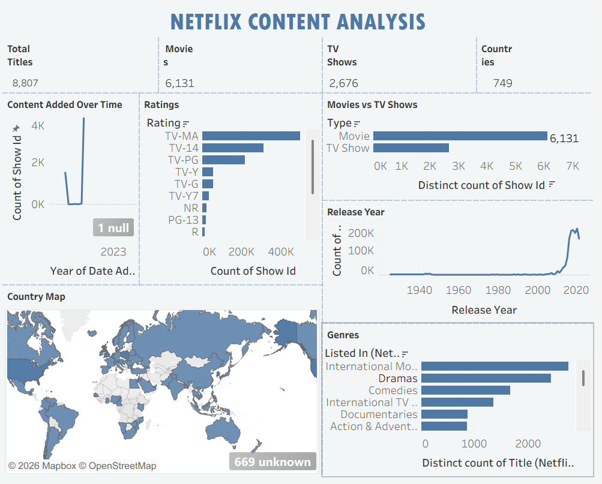

# 🎬 Netflix Content Analysis

## 📌 Project Overview

Netflix Content Analysis is a data analysis and visualization project that explores Netflix Movies and TV Shows using Python and Tableau.

The project analyzes Netflix content based on genres, countries, ratings, release years, and content added over time. The final insights are presented through an interactive Tableau dashboard.

## 🎯 Objectives

- Analyze Movies and TV Shows on Netflix.
- Identify different genres and their distribution.
- Explore Netflix content across countries.
- Analyze content ratings and release years.
- Understand how content was added over time.
- Create an interactive Tableau dashboard.

## 🛠️ Tools & Technologies

- **Python**
- **Pandas**
- **NumPy**
- **Google Colab**
- **Tableau**
- **GitHub**

## 📂 Dataset

The Netflix Movies and TV Shows dataset contains information such as:

- Title
- Type
- Director
- Cast
- Country
- Date Added
- Release Year
- Rating
- Duration
- Genre
- Description

## 🧹 Data Cleaning

The dataset was cleaned and prepared using Python and Pandas.

Main steps include:

- Handling missing values
- Removing duplicate records
- Converting date columns
- Cleaning country and genre data
- Preparing the dataset for visualization

## 📊 Tableau Dashboard

The interactive dashboard includes:

- **Total Titles**
- **Total Movies**
- **Total TV Shows**
- **Genres**
- **Country Map**
- **Movies vs TV Shows**
- **Release Year**
- **Ratings**
- **Countries**
- **Content Added Over Time**

## 🖼️ Dashboard Preview



## 🔄 Project Workflow

```text
Raw Dataset → Data Cleaning → Data Analysis → Tableau Visualization → Dashboard
